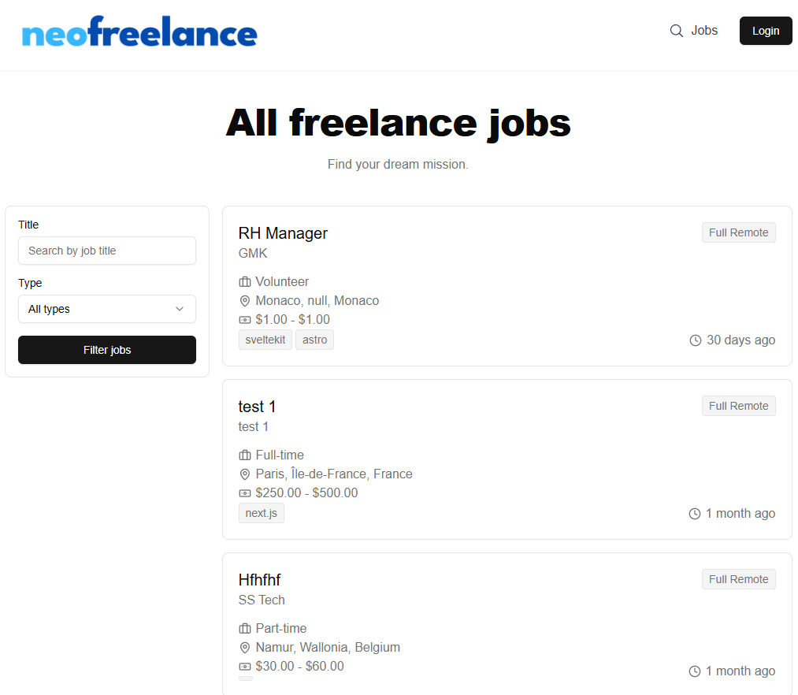

# Job Board SaaS - Next.js & MongoDB

Un tableau d'affichage des offres d'emploi moderne et évolutif, développé avec **Next.js 15** et **MongoDB**. Ce projet vise à simplifier la mise en relation entre recruteurs et candidats.

## 🌟 Fonctionnalités

- Publier des offres d'emploi
- Gestion des utilisateurs (recruteurs et candidats)
- Recherche et filtrage des offres d'emploi
- Interface moderne et responsive

---

## 🚀 Aperçu



---

## 🛠️ Installation

L'installation peut aussi se faire avec un PaaS comme [DokPloy](https://github.com/Dokploy)

### Prérequis

- Node.js >= 18
- Next.js >= 15
- MongoDB en local ou via un service cloud comme Atlas

### Étapes

1. Clonez le dépôt :

   ```bash
   git clone https://github.com/rapidosaas/job-board-nextjs.git
   cd job-board-nextjs

2. Installez les dépendances :

   ```bash
   npm install
   
4. Configurez les variables d'environnement :

   Créez un fichier .env.local à la racine avec les clés suivantes :

   ```env
   MONGO_URI=mongodb://localhost:27017/neofreelance
   NEXTAUTH_URL=http://localhost:3000
   NEXTAUTH_SECRET=nextauth_something
   EMAIL_SERVER=smtp://<username>:<password>@<smtp-host>:<port>
   EMAIL_FROM=youremail@example.com

5. Lancez le serveur de développement :

   ```bash
   npm run dev

7. Ouvrez http://localhost:3000 dans votre navigateur pour accéder à l'application.

## 🤝 Contribuer

Les contributions sont les bienvenues ! Voici comment :

- Forkez le projet.
- Créez une branche pour votre fonctionnalité : git checkout -b feature/ma-fonctionnalite.
- Soumettez une Pull Request.

## 📜 Licence

GNU/AFFERO
